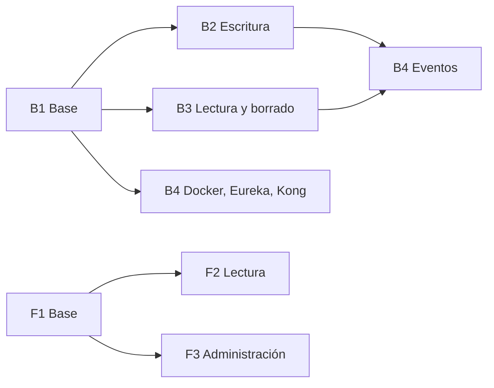

# Plan de trabajo — Segunda entrega

Qué le toca a cada integrante del equipo B, en qué orden, qué necesita y cómo saber que terminó.

**Orden de lectura para empezar:**

1. [Guía de inicio](GUIA-INICIO.md): instalar las herramientas y clonar el repo.
2. Este plan: qué te toca y en qué rama.
3. [Guía de git](GUIA-GIT.md): cómo trabajar día a día (pull, commits, push, pull requests y conflictos).

La fuente de verdad es el [contrato](docs/CONTRATO-CATALOGO.md). Si algo de este plan lo contradice, manda el contrato. El contrato no se cambia sin acordarlo con los equipos A y C.

## Resumen

| Tarea | Responsable | Entrega | Historias | Depende de |
|---|---|---|---|---|
| **B1** Base del proyecto | Rances Ramírez | Esqueleto, Mongo, modelos, categorías, errores | 6 | — |
| **B2** Escritura | Hector Franco | `POST /productos`, `PUT /productos/{id}` | 1, 4 | B1 |
| **B3** Lectura y borrado | Jhon Velandia | `GET /productos`, `GET /productos/{id}`, `DELETE /productos/{id}` | 2, 3, 5 | B1 |
| **B4** Infraestructura y eventos | Cristian Rivera | RabbitMQ, Docker, Eureka, Kong, Swagger | — | B1; los eventos, también B2 y B3 |
| **F1** Base del frontend | Juan Diego Tellez | Proyecto Vue, rutas, cliente HTTP, errores | — | — |
| **F2** Vistas de lectura | Roger Hernandez | Listado y detalle | 2, 3 | F1; para datos reales, B3 |
| **F3** Vistas de administración | Carlos Beltrán | Crear, editar y desactivar | 1, 4, 5 | F1; para datos reales, B2 y B3 |

## Orden de trabajo



1. **B1 ya está en `main`** (pull request #1): era la base de todo lo demás.
2. **B2, B3 y B4 trabajan en paralelo**, cada uno en su rama.
3. **B4 conecta los eventos al final**, cuando B2 y B3 ya estén en `main`, porque los eventos se publican desde las operaciones que ellos programan.
4. **El frontend puede empezar ya.** F1 no depende del backend. Para la entrega, las vistas deben usar los endpoints reales, sin datos inventados (contrato §9). Mientras B2 y B3 terminan, `GET /categorias` ya funciona.

### ¿Quién depende de quién?

| Tarea | Puede empezar | Espera a | Quién la espera |
|---|---|---|---|
| B1 | ✅ Terminada | — | B2, B3 y B4 |
| B2 | Ya | Nadie | B4 (eventos) y F3 (para usar datos reales) |
| B3 | Ya | Nadie | B4 (eventos), F2 y F3 (para usar datos reales) |
| B4: Docker, Eureka, Kong, Swagger | Ya | Nadie | Nadie |
| B4: eventos | Cuando B2 y B3 estén en `main` | B2 y B3 | Nadie |
| F1 | Ya | Nadie | F2 y F3 |
| F2 | Cuando F1 esté en `main` | F1 (y B3 para datos reales) | Nadie |
| F3 | Cuando F1 esté en `main` | F1 (y B2 y B3 para datos reales) | Nadie |

- **B2 y B3 no se esperan entre sí,** pero los dos agregan métodos a `ProductoService` y `ProductoController`. Quien una su PR de segundo tendrá que resolver un conflicto sencillo (ver la sección 7 de la [guía de git](GUIA-GIT.md)).
- **"Para datos reales"** significa que el frontend puede construir la vista antes, pero solo la termina cuando el endpoint que usa ya está en `main`.

## Cómo trabajamos con git

**Nadie trabaja directo en `main`.** Cada tarea vive en su propia rama y entra a `main` con un *pull request* (PR) que revisa otro integrante. El paso a paso completo está en la [guía de git](GUIA-GIT.md): cómo empezar la tarea, qué hacer cada día, cómo subir, cómo abrir el PR y qué hacer si git se queja.

| Tarea | Rama |
|---|---|
| B1 | `b1-base` |
| B2 | `b2-escritura` |
| B3 | `b3-lectura` |
| B4 | `b4-infra` (puede dividirse en varias ramas y PR: Docker, Eureka, Kong, eventos) |
| F1, F2, F3 | `f1-base`, `f2-lectura`, `f3-admin` |

**1. Crear tu rama desde un `main` actualizado** (una vez por tarea):

```powershell
git switch main
git pull
git switch -c b2-escritura
```

**2. Mientras trabajas**, guarda y sube seguido. El `-u origin <rama>` solo hace falta la primera vez; después basta con `git push`.

```powershell
git add .
git commit -m "Describe lo que hiciste"
git push -u origin b2-escritura
```

**3. Si `main` cambió mientras trabajabas** (por ejemplo, porque entró la tarea de otro), trae esos cambios a tu rama:

```powershell
git switch main
git pull
git switch b2-escritura
git merge main
```

**4. Al terminar**, abre el PR en GitHub: pestaña **Pull requests → New pull request**, con base `main` y compare tu rama. Otro integrante lo revisa; cuando lo aprueba, se hace **Merge** y se borra la rama.

**Conflictos:** B2 y B3 agregan métodos a los mismos archivos (`ProductoService`, `ProductoController`). Es probable que al unir el segundo PR git marque un conflicto. Casi siempre la solución es conservar los métodos de los dos.

## Convenciones del backend

- **Paquetes por capa** dentro de `co.edu.uis.catalogo`: `model`, `repository`, `service`, `controller`, `dto`, `config`, `error`. Reflejan el diagrama de [ARQUITECTURA-CATALOGO.md](docs/ARQUITECTURA-CATALOGO.md).
- **Nombres:** el dominio y los métodos en español (`Producto`, `listar`); los sufijos técnicos en inglés (`Controller`, `Service`, `Repository`, `Request`, `Response`).
- **Entidades = clases; DTOs = records.** Los DTOs (`ProductoRequest`, `ProductoResponse`) definen lo que entra y sale por la API: nunca se devuelve la entidad directamente. Cada `Response` tiene un método estático `desde(entidad)`.
- **`Producto` no tiene setters.** Se modifica solo con:
  - el constructor con datos → POST
  - `actualizar(...)` → PUT (no toca `id` ni `activo`)
  - `desactivar()` → DELETE (el único que cambia `activo`)
- **Inyección por constructor** con campos `final`. Nada de `@Autowired` sobre campos.
- **Rutas sin prefijo:** el servicio expone `/productos` y `/categorias`; el prefijo `/api/catalogo` lo agrega Kong.
- **Errores:** lanza las excepciones de B1 y el manejador global las convierte en `{codigo, mensaje}`. No armes respuestas de error a mano en los controllers.
- **Precio (`BigDecimal`):** compáralo con `compareTo`, no con `equals` (`49900` y `49900.00` no son `equals`).
- **Mongo tiene que estar encendido** para correr la app y las pruebas: la carga de categorías escribe en Mongo al arrancar.
- **Para probar endpoints** en Windows, usa la extensión **REST Client** de VS Code con archivos `.http`. Así evitas los problemas de comillas de `curl` en PowerShell.
- **Pruebas automáticas:** `ManejadorGlobalErroresTest` (en `backend/src/test`) es un ejemplo de cómo probar la capa web con `@WebMvcTest` y `MockMvc`, sin necesidad de Mongo.
- **Documentación del código:** cada clase lleva un Javadoc (`/** ... */`) que explica qué papel cumple, y cada método no evidente dice qué regla del contrato aplica. No comentes lo obvio (getters, asignaciones). Si cambias un código, actualiza su comentario: uno desactualizado confunde más que ninguno. El código de B1 sirve de ejemplo.

## Definición de terminado (tareas de backend)

- [ ] Compila y `.\mvnw.cmd test` pasa (con Mongo encendido)
- [ ] Probado contra el contrato: mismos campos, códigos de estado y errores
- [ ] Clases y métodos nuevos documentados (ver "Documentación del código" en las convenciones)
- [ ] Casilla de la historia marcada en el README
- [ ] PR revisado por otro integrante y unido a `main`

---

## B1 — Base del proyecto

**Responsable:** Rances Ramírez · **Rama:** `b1-base` · **Estado:** ✅ terminado, en `main` desde el pull request #1

- [x] Esqueleto (Spring Boot 4.1.1, Java 21)
- [x] Conexión a MongoDB 7.0 con Docker Compose
- [x] Modelos `Producto` y `Categoria` con sus repositorios
- [x] Carga de categorías + Historia 6 (`GET /categorias`)
- [x] Manejo global de errores `{codigo, mensaje}` (`ManejadorGlobalErrores`), con sus pruebas:
  - `VALIDACION_FALLIDA` (400): validación del cuerpo y de los parámetros, tipos incorrectos, JSON mal formado y `ValidacionFallidaException`
  - `PRODUCTO_NO_ENCONTRADO` (404): `ProductoNoEncontradoException`
- [x] Piezas compartidas, para que B2 y B3 no creen los mismos archivos al mismo tiempo:
  - `ProductoResponse`, con los campos del contrato §3
  - `ProductoService`, con los repositorios ya inyectados y `buscarExistente(id)`, que lanza el 404 si el producto no existe
  - `ProductoController`, vacío, en `/productos`
- [x] Código documentado con Javadoc: qué hace cada clase y qué regla del contrato aplica cada método

## B2 — Escritura (Historias 1 y 4)

**Rama:** `b2-escritura`

**Qué entrega**

- `POST /productos` → **201** con el producto creado, incluido su `id`
- `PUT /productos/{id}` → **200** con el producto actualizado

**Cómo**

- Crear `ProductoRequest` (record), el mismo para POST y PUT, con las reglas del contrato §3:

  | Campo | Regla |
  |---|---|
  | `nombre` | `@NotBlank`, `@Size(max = 120)` |
  | `precio` | `@NotNull`, `@Positive` |
  | `categoria` | `@NotBlank` y además debe existir |
  | `stock` | `@NotNull`, `@PositiveOrZero` |
  | `descripcion`, `imagenes` | Opcionales |

- **Escribe el mensaje de cada validación en español**, por ejemplo `@NotBlank(message = "es obligatorio")`. Si no lo haces, el mensaje sale en el idioma que pida el cliente, y el mismo error puede llegar en español a un navegador y en inglés a otro programa.
- `ProductoRequest` **no tiene `id` ni `activo`**: si el cliente los envía, se ignoran solos (contrato §2).
- **Categoría existente:** se valida en `ProductoService` con `categoriaRepository.existsById(...)`. Si no existe, lanza `ValidacionFallidaException` (400), **no** 404.
- **POST:** `new Producto(...)`; el producto nace activo.
- **PUT:** busca el producto con `buscarExistente(id)`, que ya lanza el 404 si no existe, y llama a `producto.actualizar(...)`. Sobre un producto inactivo responde 200 y sigue inactivo.

**Cómo verificar**

| Caso | Esperado |
|---|---|
| POST válido | 201, con `id` y `activo: true` |
| POST sin `nombre`, con `precio: 0`, con `stock: -1` o con nombre de 121 caracteres | 400 `VALIDACION_FALLIDA` |
| POST con categoría inexistente | 400 `VALIDACION_FALLIDA` |
| POST con `activo: false` o con un `id` en el cuerpo | Se ignoran: nace activo y con id nuevo |
| PUT válido | 200 con los datos nuevos |
| PUT a un id inexistente | 404 `PRODUCTO_NO_ENCONTRADO` |
| PUT a un producto inactivo | 200 y sigue con `activo: false` |

En Mongo (`db.productos.findOne()`), el precio debe verse como `Decimal128('...')`.

## B3 — Lectura y borrado (Historias 2, 3 y 5)

**Rama:** `b3-lectura`

**Qué entrega**

- `GET /productos` → 200 con `{productos, total, pagina, tamanoPagina}`, solo con productos activos
- `GET /productos/{id}` → 200 (también si está inactivo) o 404
- `DELETE /productos/{id}` → 204 o 404

**Cómo**

- Parámetros de `GET /productos` (contrato §2): `pagina` (por defecto 1, mínimo 1), `tamanoPagina` (por defecto 20, entre 1 y 100) y `categoria` (opcional).
- En el repositorio, métodos derivados con `Pageable`, por ejemplo `findByActivoTrue(Pageable)` y `findByActivoTrueAndCategoria(String, Pageable)`. Spring Data genera la consulta a partir del nombre del método.
- **La página 1 del contrato es la página 0 de Spring Data:** `PageRequest.of(pagina - 1, tamanoPagina)`.
- Definir un **orden fijo** (por ejemplo, por `id`) para que las páginas no se mezclen entre una consulta y otra.
- Validar los parámetros con `@Min` y `@Max` en los `@RequestParam`, con el mensaje en español (`@Min(value = 1, message = "...")`). El manejador de B1 convierte esos errores en `VALIDACION_FALLIDA`.
- **No** pongas `@Validated` en la clase del controller: cambia el tipo de excepción que lanza Spring, el manejador no la atraparía y el cliente recibiría un 500 en lugar de un 400.
- `GET /productos/{id}`: usa `buscarExistente(id)`, que ya lanza el 404 si no existe.
- **Para probar sin esperar el POST de B2**, crea productos a mano en Mongo. Entra a la consola con `docker exec -it catalogo-mongo mongosh catalogo` y escribe, por ejemplo: `db.productos.insertOne({nombre: "Camiseta", precio: NumberDecimal("49900"), categoria: "cat-ropa", stock: 10, imagenes: [], activo: true})`. Sal con `exit`.
- `DELETE`: busca con `buscarExistente(id)` y usa `producto.desactivar()`. Si ya estaba inactivo, responde 204 sin cambiar nada. B4 necesita saber si hubo un cambio para no publicar el evento dos veces.

**Cómo verificar**

| Caso | Esperado |
|---|---|
| `GET /productos` sin parámetros | Página 1, hasta 20 productos, solo activos |
| `?categoria=cat-ropa` | Solo los activos de ropa; `total` cuenta solo esos |
| `?pagina=` mayor que la última | 200 con `productos: []` y el mismo `total` |
| `?categoria=cat-inexistente` | 200 con `productos: []` y `total: 0` |
| `?pagina=0`, `?tamanoPagina=500` o `?pagina=abc` | 400 `VALIDACION_FALLIDA` |
| `GET /productos/{id}` de un inactivo | 200 con `activo: false` |
| `GET /productos/{id}` inexistente | 404 `PRODUCTO_NO_ENCONTRADO` |
| `DELETE` a un producto activo | 204; ya no aparece en el listado, pero sigue en Mongo |
| `DELETE` repetido | 204 otra vez, sin cambios |
| `DELETE` a un id inexistente | 404 |

## B4 — Infraestructura y eventos

**Rama:** `b4-infra` (conviene dividirla en varios PR pequeños)

**Eventos (contrato §5)**

- Spring AMQP (`spring-boot-starter-amqp`) con un exchange **topic** llamado `catalogo.eventos`.
- Routing keys: `producto.creado`, `producto.actualizado` y `producto.desactivado`. El cuerpo es un JSON con los campos del payload del contrato.
- Publicar **solo después** de guardar con éxito, y no volver a publicar en un DELETE repetido.
- Conectar las llamadas en `ProductoService` cuando B2 y B3 ya estén en `main`.

**Docker**

- `Dockerfile` del servicio y `docker-compose` con el servicio, Mongo y RabbitMQ.
- Mongo se queda en **`mongo:7.0`** (el motivo está en ARQUITECTURA §5). Toda imagen debe existir para **amd64** (Windows) y **arm64** (el Mac del equipo).
- Dentro de Docker, el servicio llega a Mongo por el nombre del servicio (`mongo:27017`), no por `localhost`. Se configura con la variable de entorno `SPRING_MONGODB_URI`.

**Eureka**

- Spring Cloud **2025.1.x**, la versión compatible con Spring Boot 4.1 según start.spring.io. Dependencia: `spring-cloud-starter-netflix-eureka-client`.
- El servicio se registra con el nombre `catalogo` (`spring.application.name`).

**Kong**

- Ruta `/api/catalogo` hacia el servicio, con **`strip_path: true`**: Kong quita el prefijo antes de reenviar la petición.
- Kong no consulta Eureka por su cuenta. Hay que decidir cómo resuelve la dirección del servicio; por ejemplo, con el nombre del servicio en la red de Docker.
- CORS: coordinar con F1 (ver "Pendientes con los otros equipos", en la sección de frontend).
- Antes de exponer el servicio, restringir `/actuator/health`, que hoy muestra detalles internos (`show-details: always`).

**Swagger**

- `springdoc-openapi`. Antes de agregarlo, verificar qué versión es compatible con Spring Boot 4.1.

---

## Frontend (Vue.js)

### Qué necesitan

- **Node.js** en su versión LTS: https://nodejs.org (instalador `.msi` de Windows).
- **VS Code** con la extensión **Vue - Official**.
- Crear el proyecto con la herramienta oficial, que usa Vite: `npm create vue@latest`. Elegir **Vue Router: sí**; Pinia: no, por ahora.
- **Mockup:** [docs/mockup-frontend-catalogo.html](docs/mockup-frontend-catalogo.html). Tiene las tres vistas, los estados compartidos y los criterios de entrega, con las reglas del contrato anotadas en cada pantalla. GitHub muestra el código del HTML; para verlo como página, ábrelo en el navegador desde tu copia del repo (doble clic en el archivo).
- **Dónde vive el código:** _por definir_ (una carpeta `frontend/` en este repo o el repo del Host App).

### Pendientes con los otros equipos

- **Integración al Host App:** los 3 equipos usan Vue, pero falta decidir cómo se integra cada módulo (contrato §9).
- **CORS:** el navegador bloquea las llamadas entre orígenes distintos (por ejemplo, de `localhost:5173` al backend). La recomendación es usar el proxy de Vite en desarrollo y el plugin CORS de Kong en integración. No hay que configurarlo también en Spring: las cabeceras se duplican y el navegador rechaza la respuesta.

### F1 — Base

**Rama:** `f1-base`

- Proyecto con Vite + Vue 3 (Composition API).
- Vue Router para las rutas del módulo.
- Cliente HTTP (Axios o `fetch`) con la URL base en una variable de entorno, por ejemplo `VITE_API_URL`. Vite solo expone al navegador las variables que empiezan con `VITE_`. A través de Kong, las rutas llevan el prefijo `/api/catalogo`.
- Los cinco estados compartidos del mockup, que usan las tres vistas: cargando, lista vacía, no encontrado (`PRODUCTO_NO_ENCONTRADO`), error de validación (`VALIDACION_FALLIDA`) y sin conexión.
- Pinia (estado global) probablemente no hace falta para este alcance; agregarlo sin necesidad es complejidad de más.

### F2 — Vistas de lectura

**Rama:** `f2-lectura`

- **Listado:** grid de productos (nombre, precio, imagen y categoría), paginación que **empieza en la página 1** y filtro por categoría. Las categorías salen de `GET /categorias`: se muestra el `nombre` y se envía el `id`.
- **Detalle:** todos los datos del producto. Si llega `activo: false`, mostrarlo como no disponible; si llega un 404, mostrar un mensaje de "no encontrado".
- **Nombre de la categoría:** cada producto trae el `id` de su categoría (`cat-ropa`), no el nombre. Para mostrar "ropa" en las tarjetas y en el detalle, crucen ese `id` con la lista de `GET /categorias`.

### F3 — Vistas de administración

**Rama:** `f3-admin`

- **Crear:** formulario con nombre, descripción, precio, categoría, **stock** e imágenes. Las validaciones del cliente repiten las del contrato (precio > 0, stock ≥ 0, nombre ≤ 120) solo para avisar rápido; la validación que cuenta es la del backend.
- **Editar:** PUT **reemplaza el producto completo**, así que el formulario carga todos los campos actuales y los envía todos, no solo el que cambió. Si falta un campo obligatorio, el backend responde 400; si falta uno opcional (descripción o imágenes), ese dato se borra.
- **Desactivar:** botón con confirmación → `DELETE`, que responde 204.

---

_Última actualización: 2026-09-11_
