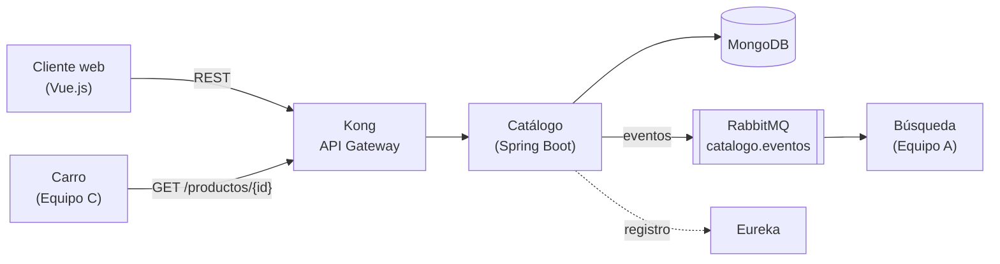

# 🛍️ Tienda Virtual — Microservicio de Catálogo


**Equipo B** · Ingeniería de Software II · Universidad Industrial de Santander (UIS)

Catálogo es la **fuente de verdad de los productos** de la tienda virtual. Expone un CRUD de productos por REST (a través de Kong) y publica eventos en RabbitMQ para que los demás servicios se mantengan sincronizados.

## Arquitectura



El detalle de las capas internas está en [ARQUITECTURA-CATALOGO.md](docs/ARQUITECTURA-CATALOGO.md).

## Documentación

**¿Eres del equipo y vas a empezar?** Lee en este orden: [guía de inicio](GUIA-INICIO.md) → [plan de trabajo](PLAN-DE-TRABAJO.md) → [guía de git](GUIA-GIT.md).

| Documento | Contenido |
|---|---|
| [Contrato de servicio](docs/CONTRATO-CATALOGO.md) | Endpoints, modelos, errores y eventos acordados con los equipos A y C (v2.2) |
| [Historias de usuario](docs/HISTORIAS.md) | Backlog con criterios de aceptación |
| [Arquitectura](docs/ARQUITECTURA-CATALOGO.md) | Stack, capas internas y decisiones de diseño |
| [Guía de inicio](GUIA-INICIO.md) | Instalar las herramientas y dejar el proyecto corriendo (Windows) |
| [Plan de trabajo](PLAN-DE-TRABAJO.md) | Qué hace cada integrante, en qué orden y cómo verificarlo |
| [Guía de git](GUIA-GIT.md) | Cómo trabajar en equipo con ramas y pull requests |
| [Mockup del frontend](docs/mockup-frontend-catalogo.html) | Las vistas del módulo Catálogo con las reglas del contrato (se abre en el navegador) |

## Estructura del repositorio

```
├── docs/                Documentación del proyecto y mockup del frontend
├── backend/             Microservicio de Catálogo (Spring Boot)
├── GUIA-INICIO.md       Instalación y primer arranque
├── PLAN-DE-TRABAJO.md   Tareas del equipo
└── GUIA-GIT.md          Cómo trabajar con git
```

## Cómo ejecutar el backend

**Requisitos:** JDK 21 y Docker Desktop abierto. No hace falta instalar Maven: el proyecto trae el Maven Wrapper (`mvnw`).

```bash
cd backend
docker compose up -d     # levanta MongoDB 7.0 en un contenedor
./mvnw test              # corre las pruebas (necesitan Mongo encendido)
./mvnw spring-boot:run   # arranca el servicio en http://localhost:8080
```

En Windows (PowerShell) usa `.\mvnw.cmd` en lugar de `./mvnw`.

Para comprobar que todo funciona, abre http://localhost:8080/actuator/health: debe decir `"status":"UP"`, también en `mongo`.

> Esta sección se irá actualizando a medida que se integren RabbitMQ, Eureka y Kong.

## Estado — Segunda entrega

- [x] Documentación: historias, arquitectura y contrato
- [x] Esqueleto del backend
- [x] Conexión a MongoDB con Docker
- [x] Manejo de errores con el formato del contrato
- [ ] Historia 1 — Registrar producto
- [ ] Historia 2 — Listar productos
- [ ] Historia 3 — Ver detalle de un producto
- [ ] Historia 4 — Actualizar producto
- [ ] Historia 5 — Desactivar producto
- [x] Historia 6 — Listar categorías
- [ ] Publicación de eventos en RabbitMQ
- [ ] Registro en Eureka
- [ ] Integración con Kong

## Equipo B

| Integrante | Parte | Tarea |
|---|---|---|
| Rances Alejandro Ramírez Morillo | Backend | B1 — Base del proyecto |
| Hector Julian Franco Trujillo | Backend | B2 — Escritura |
| Jhon Jairo Velandia Ramirez | Backend | B3 — Lectura y borrado |
| Cristian Rivera | Backend | B4 — Infraestructura y eventos |
| Juan Diego Tellez Quintero | Frontend | F1 — Base del frontend |
| Roger Sergio Hernandez | Frontend | F2 — Vistas de lectura |
| Carlos Andrés Beltrán Ardila | Frontend | F3 — Vistas de administración |
