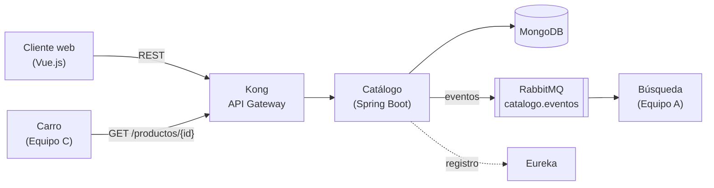

# 🛍️ Tienda Virtual — Microservicio de Catálogo


**Equipo B** · Ingeniería de Software II · Universidad Industrial de Santander (UIS)

Catálogo es la **fuente de verdad de los productos** de la tienda virtual. Expone un CRUD de productos por REST (a través de Kong) y publica eventos en RabbitMQ para que los demás servicios se mantengan sincronizados.

## Los tres repositorios

| Repositorio | Qué contiene | Quién trabaja ahí |
|---|---|---|
| **teambsoft-backend** (este) | El microservicio en Spring Boot y **toda la documentación** | B1 a B4 |
| [teambsoft-frontend](https://github.com/rancesra/teambsoft-frontend) | El módulo de frontend en Vue.js y sus mockups | F1 a F3 |
| [teambsoft-hostapp](https://github.com/rancesra/teambsoft-hostapp) | El cascarón donde se montan los módulos de los 3 equipos | H1 |

**Toda la documentación vive aquí**, para que no existan dos versiones distintas de un mismo acuerdo. Los otros dos repositorios la enlazan.

## Arquitectura



El detalle de las capas internas está en [ARQUITECTURA-CATALOGO.md](docs/ARQUITECTURA-CATALOGO.md).

## Documentación

**¿Eres del equipo y vas a empezar?** Lee en este orden: [guía de inicio](docs/guias/GUIA-INICIO.md) → [plan de trabajo](docs/PLAN-DE-TRABAJO.md) → [guía de git](docs/guias/GUIA-GIT.md).

### Acuerdos y diseño

Lo que manda. Si el código contradice a alguno de estos, el equivocado es el código.

| Documento | Versión | Contenido |
|---|---|---|
| [Contrato de servicio](docs/CONTRATO-CATALOGO.md) | v2.3 | Endpoints, modelos, errores y eventos acordados con los equipos A y C |
| [Contrato del Host App](https://github.com/rancesra/teambsoft-hostapp/blob/main/CONTRATO-HOSTAPP.md) | v1.0 | Cómo se integra cada módulo al cascarón: rutas, qué expone cada uno y estilo compartido |
| [Historias de usuario](docs/HISTORIAS.md) | v1.2 | Las 8 historias con sus criterios de aceptación |
| [Arquitectura](docs/ARQUITECTURA-CATALOGO.md) | v1.5 | Stack, capas internas y decisiones de diseño |
| [Plan de trabajo](docs/PLAN-DE-TRABAJO.md) | — | Qué hace cada integrante, en qué orden y cómo verificarlo |
| [Informe del Sprint 0](docs/INFORME-SPRINT-0.md) | — | Entregado. La foto del proyecto al cerrar el sprint anterior |

### Guías para trabajar

| Guía | Para quién |
|---|---|
| [Guía de inicio](docs/guias/GUIA-INICIO.md) | Todos: instalar las herramientas y dejar el proyecto corriendo (Windows) |
| [Guía de git](docs/guias/GUIA-GIT.md) | Todos: ramas, commits, pull requests y conflictos |
| [Guía de Jira](docs/guias/JIRA.md) | Todos: el tablero, los estados y la clave del ticket en las ramas |
| [B2 — Escritura](docs/guias/B2-ESCRITURA.md) | Hector: `POST`, `PUT`, activar y descontar stock |
| [B3 — Lectura y borrado](docs/guias/B3-LECTURA.md) | Jhon: listado con filtros, detalle y `DELETE` |
| [B4 — Infraestructura](docs/guias/B4-INFRAESTRUCTURA.md) | Cristian: RabbitMQ, Docker, Eureka, Kong y Swagger |
| [F1 — Base del frontend](docs/guias/F1-BASE.md) | Juan Diego: proyecto Vue, enrutador, cliente HTTP y estados |
| [F2 — Vistas de lectura](docs/guias/F2-LECTURA.md) | Roger: listado y detalle |
| [F3 — Administración](docs/guias/F3-ADMINISTRACION.md) | Carlos: crear, editar, retirar y reactivar |

Cada guía trae el código **ya probado**, el árbol de archivos, cómo verificar cada paso y una tabla de errores comunes.

### Diseño del frontend

| Documento | Dónde |
|---|---|
| [Mockup del módulo en el Host App](https://github.com/rancesra/teambsoft-frontend/blob/main/docs/mockup-catalogo-hostapp.html) | Repo de frontend. Qué lleva cada pantalla y por qué |
| [Propuesta visual](https://github.com/rancesra/teambsoft-frontend/blob/main/docs/propuesta-visual-catalogo.html) | Repo de frontend. Cómo se ve, con las variables de estilo compartidas |
| [Mockup del Sprint 0](docs/mockup-frontend-catalogo.html) | Aquí. La primera versión, que cita el informe |

Los mockups son HTML: GitHub los muestra como código, hay que abrirlos en el navegador desde tu copia.

## Estructura del repositorio

```
├── src/                     Código del microservicio (Spring Boot)
├── pom.xml                  Dependencias y compilación (Maven)
├── docker-compose.yml       MongoDB para desarrollo
└── docs/                    Toda la documentación
    ├── CONTRATO-CATALOGO.md
    ├── HISTORIAS.md
    ├── ARQUITECTURA-CATALOGO.md
    ├── PLAN-DE-TRABAJO.md
    ├── INFORME-SPRINT-0.md
    ├── diagrama-sistema.jpeg
    └── guias/               Una guía por tarea, más git, inicio y Jira
```

**La raíz del repositorio es la raíz del proyecto Maven** (`./mvnw` se ejecuta desde aquí) y `docs/` es todo lo demás. Nada de documentación en la raíz, salvo este README.

## Cómo ejecutar el backend

**Requisitos:** JDK 21 y Docker Desktop abierto. No hace falta instalar Maven: el proyecto trae el Maven Wrapper (`mvnw`).

```bash
docker compose up -d     # levanta MongoDB 7.0 en un contenedor
./mvnw test              # corre las pruebas (necesitan Mongo encendido)
./mvnw spring-boot:run   # arranca el servicio en http://localhost:8080
```

En Windows (PowerShell) usa `.\mvnw.cmd` en lugar de `./mvnw`.

Para comprobar que todo funciona, abre http://localhost:8080/actuator/health: debe decir `"status":"UP"`, también en `mongo`.

> Esta sección se irá actualizando a medida que se integren RabbitMQ, Eureka y Kong.

## Estado — Segunda entrega

- [x] Documentación: historias, arquitectura y contrato
- [x] Esqueleto del backend
- [x] Conexión a MongoDB con Docker
- [x] Manejo de errores con el formato del contrato
- [ ] Historia 1 — Registrar producto
- [ ] Historia 2 — Listar productos
- [ ] Historia 3 — Ver detalle de un producto
- [ ] Historia 4 — Actualizar producto
- [ ] Historia 5 — Desactivar producto
- [x] Historia 6 — Listar categorías
- [ ] Historia 7 — Reactivar producto
- [ ] Historia 8 — Ver los productos desactivados
- [ ] Descuento de stock en el checkout
- [ ] Publicación de eventos en RabbitMQ
- [ ] Registro en Eureka
- [ ] Integración con Kong

## Equipo B

| Integrante | Parte | Tarea |
|---|---|---|
| Rances Alejandro Ramírez Morillo | Backend · Host App | B1 — Base del proyecto · H1 — Host App |
| Hector Julian Franco Trujillo | Backend | B2 — Escritura |
| Jhon Jairo Velandia Ramirez | Backend | B3 — Lectura y borrado |
| Cristian Rivera | Backend | B4 — Infraestructura y eventos |
| Juan Diego Tellez Quintero | Frontend | F1 — Base del frontend |
| Roger Sergio Hernandez | Frontend | F2 — Vistas de lectura |
| Carlos Andrés Beltrán Ardila | Frontend | F3 — Vistas de administración |
