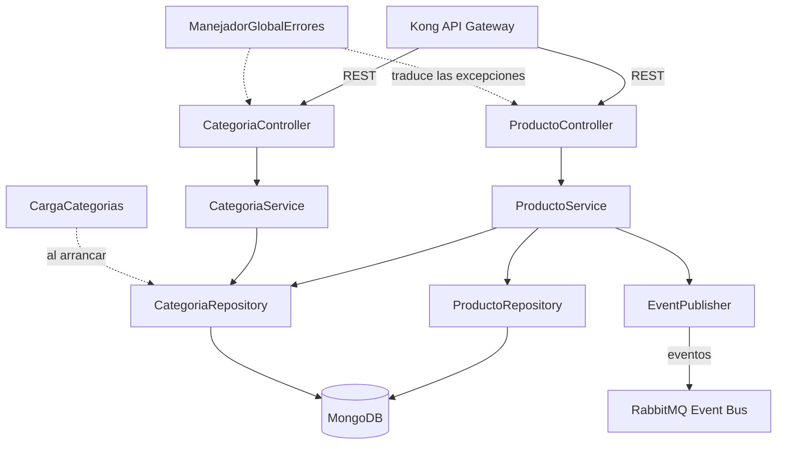

# Arquitectura — Catálogo (Equipo B)

**Entrega:** Primera entrega — Ciclo 1 (actualizado en Ciclo 2)
**Versión:** 1.4
**Fecha:** 2026-09-21

## 1. Rol en el sistema

Catálogo es uno de los 5 microservicios del sistema (junto a Búsqueda, Carro, Descuento y Órdenes), y es la **fuente de verdad de los productos**. Todo el tráfico externo pasa por Kong (API Gateway); Catálogo se registra en Eureka para ser descubierto, y publica eventos a RabbitMQ para que Búsqueda mantenga su índice sin consultarlo directamente. El diagrama general del sistema (ya entregado por el equipo) muestra este contexto completo; este documento se enfoca solo en la pieza de Catálogo.

## 2. Stack tecnológico

| Tecnología | Uso en Catálogo |
|---|---|
| Spring Boot 4.1.1 (Java 21) | Framework del microservicio |
| MongoDB 7.0 | Persistencia de productos y categorías (documento, no relacional) |
| Spring Data MongoDB | Capa de acceso a datos |
| Eureka Client | Registro y descubrimiento del servicio |
| Docker (Docker Compose) | Empaquetado y entorno reproducible; en desarrollo, MongoDB corre en un contenedor definido en `docker-compose.yml` |
| RabbitMQ (vía Spring AMQP) | Publicación de eventos de dominio |

## 3. Arquitectura interna

Capas:

- **Controller** expone los endpoints REST, valida la entrada y convierte entre HTTP y DTOs.
- **Service** contiene la lógica de negocio: las reglas del contrato, el 404 cuando un producto no existe y el soft delete.
- **Repository** es la interfaz de Spring Data hacia MongoDB.
- **EventPublisher** emitirá los eventos de dominio después de cada escritura exitosa (tarea B4, en construcción).

Además:

- Los **DTOs** (`ProductoResponse`, `CategoriaResponse` y, con B2, `ProductoRequest`) definen lo que entra y sale por la API, separados de las entidades que se guardan en Mongo.
- **ManejadorGlobalErrores** (`@RestControllerAdvice`) atrapa las excepciones de cualquier capa y responde con el formato de error del contrato (§4). Los controllers y services solo lanzan excepciones.
- **CargaCategorias** guarda las categorías del contrato cada vez que arranca el servicio.
- El servicio se registra en **Eureka** al arrancar (tarea B4).

> Nota: este diagrama se renderiza automáticamente al ver el archivo en GitHub (soporta Mermaid de forma nativa en Markdown).

## 4. Modelo de datos

Producto y Categoría, con sus campos y reglas de validación, están definidos en detalle en `CONTRATO-CATALOGO.md`. En resumen: Producto es el documento principal (nombre, precio, categoría, stock, imágenes, activo); Categoría es una lista precargada y de solo lectura en esta fase.

## 5. Decisiones de diseño

- **MongoDB en vez de relacional:** los productos no siempre comparten los mismos atributos, y el modelo de documento evita forzar una estructura rígida.
- **Soft delete (`activo:false`) en vez de borrado físico:** preserva integridad si otro servicio (como Órdenes, más adelante) referencia un producto históricamente.
- **El precio y el stock los valida y devuelve siempre Catálogo, nunca el cliente:** evita que Carro u otro servicio confíen en datos que el usuario podría manipular.
- **Eventos hacia Búsqueda, llamada síncrona para Carro:** Búsqueda no necesita el dato al instante y vive bien con un índice eventualmente consistente; Carro sí necesita confirmar en el momento antes de dejar continuar al usuario.
- **Errores con código, no solo texto:** permite que cualquier consumidor reaccione programáticamente sin parsear mensajes.
- **MongoDB 7.0 y no 8.x, con versión fijada:** MongoDB 8 no arranca con los kernels Linux 6.19 a 7.0.13. Un cambio del kernel afectó su administrador de memoria, y MongoDB decidió bloquear el arranque para evitar caídas y posible corrupción de datos. Docker Desktop en macOS usa hoy una máquina virtual con kernel 7.0.12, así que la 8 no arranca en el equipo de uno de los integrantes. Según la matriz de compatibilidad oficial de MongoDB (ticket SERVER-125742), la 7.0 funciona con cualquier kernel. Fijar `mongo:7.0` en `docker-compose.yml`, en vez de usar `latest`, garantiza que todo el equipo use la misma versión en Mac y en Windows. Para Catálogo no hay diferencia funcional; se puede volver a la 8 cuando Docker Desktop traiga un kernel 7.0.14 o superior.
- **Errores centralizados con el formato del contrato, no ProblemDetail:** un único `@RestControllerAdvice` traduce a `{codigo, mensaje}` tanto nuestras excepciones como las de validación de Spring (cuerpo, parámetros, tipos y JSON mal formado). Spring ofrece ProblemDetail (RFC 9457) como formato estándar, pero el formato ya estaba acordado con los equipos A y C. Los errores que el contrato no contempla (fallas inesperadas, rutas inexistentes) usan el formato por defecto de Spring.
- **Precio como `BigDecimal`, guardado como `Decimal128`:** `double` introduce errores de redondeo con dinero y `long` no admite decimales. Guardarlo como texto impediría comparar u ordenar por precio en Mongo. Desde Spring Data MongoDB 5.0 no hay una representación por defecto para `BigDecimal`, así que se configura explícitamente en `application.yml`.
- **Entidades sin setters y DTOs separados:** `Producto` solo cambia con su constructor (POST), `actualizar(...)` (PUT) y `desactivar()` (DELETE). Así, las reglas del contrato (PUT no toca `id` ni `activo`; solo DELETE cambia `activo`) quedan en el código y no solo en el documento. La API nunca expone las entidades, sino DTOs, para que un cambio en la base de datos no cambie el contrato sin querer.
- **Descuento de stock con una operación atómica de MongoDB, no con transacciones:** `POST /productos/descontar-stock` descuenta con un `updateOne` condicionado (`{_id, activo: true, stock: {$gte: cantidad}}` con `$inc` negativo). MongoDB garantiza atomicidad **por documento**, así que dos checkouts simultáneos sobre el mismo producto no pueden pasar los dos: el segundo no encuentra documento que cumpla la condición y se responde 409. Se descartó usar transacciones multi-documento porque exigen un conjunto de réplicas y esta entrega corre un Mongo de un solo nodo; cuando un ítem falla, el servicio revierte los descuentos ya hechos en esa misma petición, una compensación de mejor esfuerzo que es suficiente para el alcance actual. También se descartó una reserva con retención (apartar stock y liberarlo por tiempo), que arrastra expiraciones y un compensador que hoy no tiene dueño: el equipo de Órdenes no está asignado.
- **Un repositorio por frente, no uno solo con las dos partes:** el microservicio vive en `teambsoft-backend` y el módulo de frontend en `teambsoft-frontend`. Cada frente tiene su propio ciclo: el backend se compila con Maven y se despliega como contenedor; el frontend se construye con Vite y termina integrándose al Host App. Separarlos deja cada repositorio con la forma que esperan sus herramientas (la raíz del repositorio del backend es la raíz del proyecto Maven) y evita que un cambio de Vue pase por la revisión de Java. El costo es que la documentación no se puede duplicar: el contrato, las historias y este documento viven solo en el repositorio del backend y el del frontend los enlaza. La separación se hizo antes de que existiera código de frontend, que es cuando no obliga a reescribir historial.
- **Categorías precargadas desde el código, de forma idempotente:** se guardan al arrancar con ids fijos, así que repetir el arranque no crea duplicados. Se descartó un script de Mongo en Docker porque solo se ejecuta cuando el volumen está vacío.

## 6. Documentos relacionados

- `CONTRATO-CATALOGO.md` — contrato completo de endpoints, modelos y eventos (entregable de Segunda entrega, Ciclo 2)
- `HISTORIAS.md` — backlog de historias de usuario de Catálogo

## 7. Historial de cambios

| Fecha | Cambio |
|---|---|
| 2026-08-21 | v1.0 — versión inicial (Primera entrega) |
| 2026-09-10 | v1.1 — Se fijan las versiones del stack (Spring Boot 4.1.1 con Java 21, MongoDB 7.0) y se documenta por qué MongoDB 7.0 y no 8.x |
| 2026-09-11 | v1.2 — La arquitectura interna refleja lo construido en B1 (categorías, DTOs, manejador global de errores y carga de categorías). Nuevas decisiones: formato de errores, precio como Decimal128, entidades sin setters y carga idempotente de categorías |
| 2026-09-21 | v1.3 — El módulo se separa en dos repositorios (`teambsoft-backend` y `teambsoft-frontend`) y el proyecto Maven pasa a la raíz del repositorio del backend. Se actualizan las rutas afectadas y se documenta la decisión. El contrato no cambia |
| 2026-09-21 | v1.4 — Se documenta cómo se descuenta el stock (operación atómica de MongoDB en vez de transacciones) y por qué se descarta la reserva con retención. Acompaña al contrato v2.3 |
