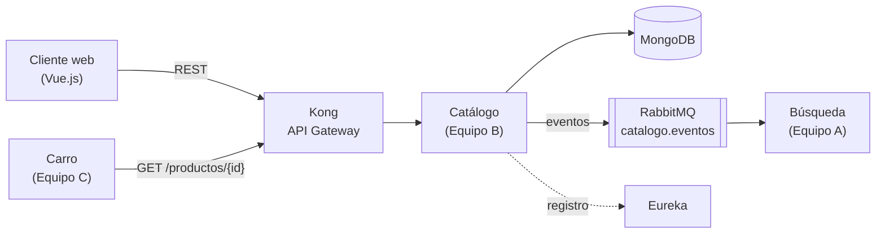
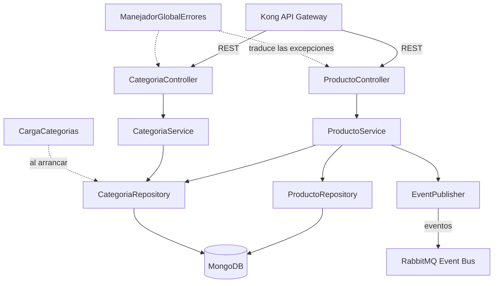
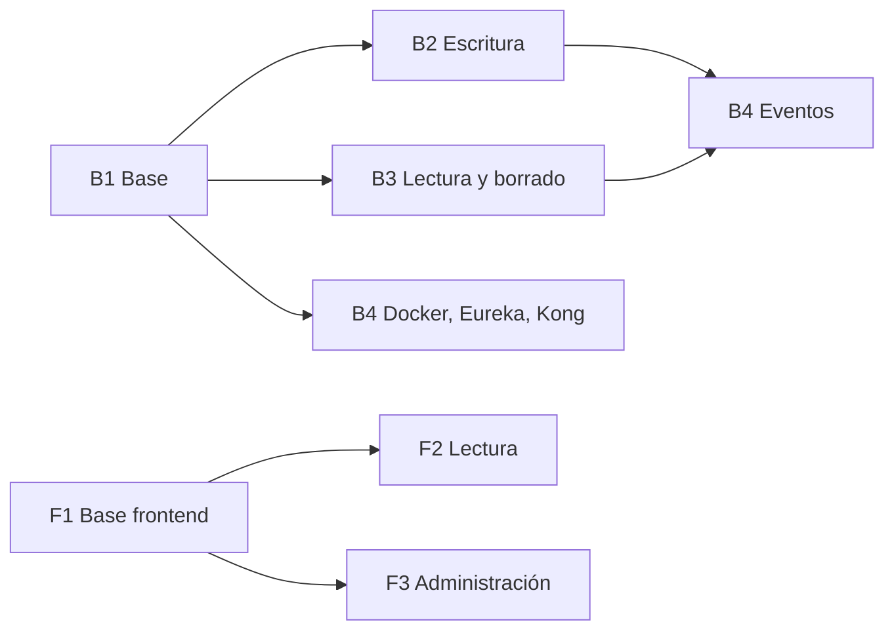

# Informe del Sprint 0 — Microservicio de Catálogo

**Equipo B** · Ingeniería de Software II · Universidad Industrial de Santander (UIS)
**Proyecto:** Tienda Virtual con arquitectura de microservicios
**Periodo del Sprint 0:** 20 de agosto – 17 de septiembre de 2026
**Versión del informe:** 1.0 · 17 de septiembre de 2026
**Repositorio:** https://github.com/rancesra/teambsoft

---

## 1. Resumen ejecutivo

El Sprint 0 es el sprint de preparación: no busca entregar toda la funcionalidad, sino dejar al equipo en condiciones de construirla sin bloquearse. Durante este sprint el Equipo B definió el alcance del módulo **Catálogo**, escribió sus historias de usuario, acordó con los equipos A y C el **contrato de servicio**, diseñó la **arquitectura interna**, preparó el **entorno de desarrollo reproducible** y dejó funcionando la **base del microservicio**.

Al cierre del sprint, el servicio arranca, se conecta a MongoDB, responde el primer endpoint del contrato (`GET /categorias`, Historia 6), maneja los errores en el formato acordado y cuenta con pruebas automáticas que lo verifican. El repositorio queda documentado para que los cuatro integrantes del backend y el equipo de frontend trabajen en paralelo.

| Indicador | Resultado |
|---|---|
| Historias definidas | 6 (con criterios de aceptación) |
| Historias implementadas | 1 de 6 (Historia 6) |
| Endpoints del contrato definidos | 6 |
| Endpoints implementados | 1 (`GET /categorias`) |
| Versión del contrato acordada | v2.2 |
| Pruebas automáticas | 7, todas en verde |
| Pull requests revisados y unidos | 2 |

---

## 2. Integrantes y roles

| Integrante | Usuario de GitHub | Rol en el sprint | Tarea asignada |
|---|---|---|---|
| Rances Alejandro Ramírez Morillo | `rancesra` | Coordinación técnica y base del proyecto | B1 — Base del backend |
| Hector Julian Franco Trujillo | `hecfrantuis` | Desarrollo backend | B2 — Escritura |
| Jhon Jairo Velandia Ramirez | `jhon613` | Desarrollo backend | B3 — Lectura y borrado |
| Cristian Rivera | `cristian007369` | Desarrollo backend | B4 — Infraestructura y eventos |
| Juan Diego Tellez Quintero | `JuanDTQ19` | Desarrollo frontend (Vue.js) | F1 — Base del frontend |
| Roger Sergio Hernandez | `RogerH2105` | Desarrollo frontend (Vue.js) | F2 — Vistas de lectura |
| Carlos Andrés Beltrán Ardila | `andress15s` | Desarrollo frontend (Vue.js) | F3 — Vistas de administración |

> El Equipo B se dividió en dos frentes: **cuatro integrantes en el backend** del microservicio y **tres en el módulo de frontend** del Cliente Web. Ambos frentes trabajan sobre el mismo contrato.

### Reparto del trabajo para el siguiente sprint

| Tarea | Responsable | Entrega | Historias |
|---|---|---|---|
| **B1** Base del proyecto | Rances Ramírez | Esqueleto, MongoDB, modelos, categorías, manejo de errores | 6 |
| **B2** Escritura | Hector Franco | `POST /productos`, `PUT /productos/{id}` | 1, 4 |
| **B3** Lectura y borrado | Jhon Velandia | `GET /productos`, `GET /productos/{id}`, `DELETE /productos/{id}` | 2, 3, 5 |
| **B4** Infraestructura y eventos | Cristian Rivera | RabbitMQ, Docker, Eureka, Kong, Swagger | — |
| **F1** Base del frontend | Juan Diego Tellez | Proyecto Vue, rutas, cliente HTTP, manejo de errores | — |
| **F2** Vistas de lectura | Roger Hernandez | Listado y detalle | 2, 3 |
| **F3** Vistas de administración | Carlos Beltrán | Crear, editar y desactivar | 1, 4, 5 |

---

## 3. Contexto del sistema

La tienda virtual está construida como un sistema de microservicios repartido entre tres equipos:

| Equipo | Microservicio | Persistencia |
|---|---|---|
| A | Búsqueda | Elasticsearch + Redis |
| **B (nosotros)** | **Catálogo** | **MongoDB** |
| C | Carro | Redis + PostgreSQL |
| Sin asignar | Descuento, Órdenes | — |

Infraestructura común: **Kong** (API Gateway), **Keycloak** (identidad), **Eureka** (registro y descubrimiento), **RabbitMQ** (bus de eventos) y **Docker** para todo.



### Papel de Catálogo y patrones que aplica

- **Fuente de verdad de los productos:** ningún otro servicio guarda el catálogo; todos lo consultan o escuchan sus eventos.
- **Database per Service:** MongoDB es exclusiva de Catálogo. Ningún otro equipo la consulta directamente.
- **Event-Driven Architecture:** cada escritura publica un evento en RabbitMQ.
- **CQRS a nivel de sistema:** Catálogo es el lado *Command* (escribe y es dueño del dato) y Búsqueda es el lado *Query* (mantiene su propio índice, consistente en diferido).
- **Comunicación síncrona vs. asíncrona:** Búsqueda se entera por eventos porque tolera unos segundos de retraso; Carro consulta por REST porque necesita confirmar precio y disponibilidad en el momento.

---

## 4. Alcance del módulo Catálogo

**Dentro del alcance**

- CRUD completo de productos y consulta de categorías (Historias 1 a 6).
- Persistencia en MongoDB, publicación de eventos en RabbitMQ, registro en Eureka y exposición a través de Kong.
- Módulo de frontend en Vue.js con las vistas de listado, detalle y administración.

**Fuera del alcance de esta entrega**

- Autenticación real con Keycloak (los endpoints de administración se documentan como tales, pero todavía no validan token).
- Gestión de categorías por API: vienen precargadas.
- Variantes de producto (talla y color con stock por variante).
- Los microservicios de Descuento y Órdenes.

---

## 5. Historias de usuario

Formato: *Como [rol], quiero [funcionalidad], para [beneficio]*, con criterios de aceptación en estilo Dado / Cuando / Entonces. Documento completo: [HISTORIAS.md](HISTORIAS.md) (v1.1).

### Historia 1 — Registrar producto
**Como** administrador, **quiero** registrar un producto con nombre, descripción, precio, categoría, stock e imágenes, **para** que esté disponible en el catálogo.
- Dado que soy administrador autenticado
- Cuando envío un producto con nombre, precio, categoría y stock válidos
- Entonces se guarda como activo y me devuelve el producto con su ID
- Y si falta un campo obligatorio o algún valor no cumple las reglas del contrato, devuelve error 400 (`VALIDACION_FALLIDA`)

### Historia 2 — Listar productos
**Como** cliente, **quiero** ver el listado de productos activos, **para** explorar qué puedo comprar.
- Dado que hay productos activos registrados
- Cuando consulto el listado
- Entonces recibo nombre, precio, imagen y categoría de cada uno
- Y los productos desactivados no aparecen
- Y puedo filtrar por categoría, y el listado viene paginado

### Historia 3 — Ver detalle de un producto
**Como** cliente, **quiero** ver el detalle de un producto, **para** decidir si lo compro.
- Dado que el producto existe
- Cuando consulto su detalle por ID
- Entonces recibo toda su información
- Y si el producto está desactivado, igual lo recibo, con `activo: false`
- Y si no existe, recibo error 404 (`PRODUCTO_NO_ENCONTRADO`)

### Historia 4 — Actualizar producto
**Como** administrador, **quiero** actualizar los datos de un producto, **para** mantener la información al día.
- Dado que soy administrador autenticado y el producto existe
- Cuando envío el producto completo con los valores nuevos
- Entonces queda actualizado con esos valores
- Y si algún valor no es válido, recibo 400; si el producto no existe, 404
- Y actualizarlo no cambia su estado: si estaba inactivo, sigue inactivo

### Historia 5 — Desactivar producto
**Como** administrador, **quiero** desactivar un producto que ya no se vende, **para** que no aparezca en el catálogo.
- Dado que soy administrador autenticado y el producto existe
- Cuando solicito desactivarlo
- Entonces queda marcado como inactivo y deja de aparecer en el listado
- Y el registro no se borra físicamente
- Y si ya estaba inactivo, la operación responde con éxito sin cambiar nada

### Historia 6 — Listar categorías ✅ *implementada*
**Como** cliente o administrador, **quiero** ver las categorías disponibles, **para** filtrar productos o clasificar uno nuevo.
- Dado que hay categorías precargadas
- Cuando consulto el listado de categorías
- Entonces recibo su id y nombre

### Priorización

| Prioridad | Historias | Justificación |
|---|---|---|
| Ciclo 2 | 1, 2, 3, 4, 5, 6 | CRUD completo, que es lo que exige la segunda entrega |
| Adelantadas respecto al plan inicial | 3 y 6 | La 3 la necesita Carro para validar antes de agregar al carrito; la 6 la necesita el formulario del frontend y es de bajo esfuerzo |

---

## 6. Contrato de servicio

El contrato es el acuerdo con los equipos A y C: define qué expone Catálogo y qué pueden esperar de él. **No se modifica de forma unilateral.** Documento completo: [CONTRATO-CATALOGO.md](CONTRATO-CATALOGO.md) (v2.2).

### 6.1 Endpoints

Se consumen a través de Kong, con el prefijo `/api/catalogo`.

| Método | Endpoint | Descripción | Auth |
|---|---|---|---|
| GET | /productos | Lista productos activos, paginado, filtro opcional `?categoria=` | Pública |
| GET | /productos/{id} | Detalle de un producto | Pública |
| GET | /categorias | Lista las categorías válidas | Pública |
| POST | /productos | Crea un producto | Admin |
| PUT | /productos/{id} | Reemplaza un producto | Admin |
| DELETE | /productos/{id} | Desactiva un producto (soft delete) | Admin |

Parámetros de `GET /productos`: `categoria` (id de categoría), `pagina` (por defecto 1, mínimo 1) y `tamanoPagina` (por defecto 20, entre 1 y 100).

### 6.2 Modelo de Producto

| Campo | Tipo | Reglas |
|---|---|---|
| id | string | Generado por MongoDB |
| nombre | string | Requerido, máx. 120 caracteres |
| descripcion | string | Opcional |
| precio | number | Requerido, mayor que 0 |
| categoria | string | Requerido, debe existir en `GET /categorias` |
| stock | integer | Requerido, mayor o igual a 0 |
| imagenes | array[string] | Opcional |
| activo | boolean | `true` al crearse; solo `DELETE` lo cambia |

### 6.3 Reglas de comportamiento acordadas

- **`GET /productos/{id}` devuelve también los productos inactivos**, con `activo: false`. El 404 es únicamente para un id que no existe.
- **`PUT` reemplaza el producto completo** y no modifica `id` ni `activo`.
- **`DELETE` es idempotente:** repetirlo responde igual y no vuelve a publicar el evento.
- **Casos borde del listado:** una página fuera de rango o una categoría inexistente devuelven 200 con lista vacía, no un error.
- **El precio y el stock los define siempre Catálogo,** nunca el cliente: así ningún servicio confía en un dato que el usuario pueda manipular.

### 6.4 Formato de error

```json
{ "codigo": "PRODUCTO_NO_ENCONTRADO", "mensaje": "descripción legible del error" }
```

Códigos definidos: `PRODUCTO_NO_ENCONTRADO` (404) y `VALIDACION_FALLIDA` (400).

### 6.5 Eventos publicados

Exchange de RabbitMQ de tipo *topic* llamado `catalogo.eventos`. Cada consumidor crea su cola y se suscribe a las routing keys que le interesen.

| Evento | Routing key | Se publica cuando | Payload mínimo |
|---|---|---|---|
| ProductoCreado | `producto.creado` | Se crea un producto | id, nombre, precio, categoria |
| ProductoActualizado | `producto.actualizado` | Se modifica cualquier campo | id, nombre, precio, categoria |
| ProductoDesactivado | `producto.desactivado` | Se hace soft delete | id |

### 6.6 Gobernanza del contrato

El contrato se versiona con versionado semántico y cada cambio queda en su historial:

| Versión | Fecha | Cambio |
|---|---|---|
| v1.0 | 2026-08-20 | Versión inicial para la reunión con los equipos A y C |
| v1.1 | 2026-08-20 | Se agrega `GET /categorias` y el modelo de Categoría |
| v2.0 | 2026-08-21 | Se reasigna al Ciclo 2 y se agrega la sección de Frontend |
| v2.1 | 2026-09-10 | Aclaraciones compatibles: paginación, productos inactivos, reglas de PUT y DELETE, exchange y routing keys |
| v2.2 | 2026-09-10 | El frontend se construye con Vue.js, acordado por los 3 equipos |

Las versiones que solo aclaran o agregan suben el número menor; un cambio que obligue a los otros equipos a modificar su código subiría el mayor.

---

## 7. Arquitectura

Documento completo: [ARQUITECTURA-CATALOGO.md](ARQUITECTURA-CATALOGO.md) (v1.2).

### 7.1 Stack tecnológico

| Tecnología | Uso en Catálogo |
|---|---|
| Spring Boot 4.1.1 (Java 21) | Framework del microservicio |
| MongoDB 7.0 | Persistencia de productos y categorías |
| Spring Data MongoDB | Capa de acceso a datos |
| Eureka Client | Registro y descubrimiento |
| RabbitMQ (vía Spring AMQP) | Publicación de eventos de dominio |
| Docker y Docker Compose | Entorno reproducible |
| Vue.js 3 + Vite | Módulo de frontend |

### 7.2 Arquitectura interna



- **Controller:** expone los endpoints REST, valida la entrada y convierte entre HTTP y DTOs.
- **Service:** contiene la lógica de negocio, las reglas del contrato y el soft delete.
- **Repository:** interfaz de Spring Data hacia MongoDB.
- **EventPublisher:** emitirá los eventos después de cada escritura exitosa (tarea B4).
- **DTOs:** definen lo que entra y sale por la API, separados de las entidades que se guardan.
- **ManejadorGlobalErrores:** traduce cualquier excepción al formato de error del contrato.

### 7.3 Decisiones de diseño

| Decisión | Alternativas descartadas | Motivo |
|---|---|---|
| MongoDB en vez de una base relacional | PostgreSQL | Database per Service; el modelo de documento admite productos con atributos distintos y se alinea con el stack propuesto |
| Soft delete (`activo:false`) | Borrado físico | Preserva la integridad si Órdenes referencia un producto histórico |
| Eventos para Búsqueda, llamada síncrona para Carro | Que ambos consulten por REST | Búsqueda tolera consistencia en diferido; Carro necesita el dato al instante |
| Errores con código, no solo texto | Mensaje libre | Cualquier consumidor puede reaccionar sin interpretar textos |
| Formato `{codigo, mensaje}` en vez de ProblemDetail (RFC 9457) | El estándar de Spring | El formato ya estaba acordado con los equipos A y C |
| Precio como `BigDecimal`, guardado como `Decimal128` | `double`, `long` o texto | `double` redondea mal el dinero, `long` no admite decimales y el texto impide comparar y ordenar por precio |
| Entidad `Producto` sin setters | Getters y setters para todo | Solo se modifica con el constructor (POST), `actualizar` (PUT) y `desactivar` (DELETE): las reglas del contrato quedan protegidas en el código |
| DTOs separados de las entidades | Devolver la entidad directamente | Evita que un cambio en la base de datos altere el contrato sin querer |
| Categorías precargadas desde el código, de forma idempotente | Script de Mongo en Docker | Funciona en cualquier entorno y no depende de que el volumen esté vacío |
| Rutas sin prefijo (`/productos`), con Kong agregando `/api/catalogo` | Que el servicio incluya el prefijo | El prefijo público es responsabilidad del gateway |
| Spring AMQP en vez de MassTransit | MassTransit | MassTransit es exclusivo de .NET; en microservicios cada servicio elige su stack mientras respete el contrato (JSON por REST y formato de eventos) |

---

## 8. Entorno de desarrollo

El entorno es reproducible y está documentado en [GUIA-INICIO.md](../GUIA-INICIO.md), escrita para Windows porque es el sistema de la mayoría del equipo.

| Herramienta | Versión | Para qué |
|---|---|---|
| JDK Temurin | 21 (LTS) | Compilar y ejecutar el backend |
| Maven Wrapper | 3.9.16 | Construir el proyecto sin instalar Maven |
| MongoDB (Docker) | 7.0 | Base de datos, con volumen persistente |
| Docker Desktop | — | Levantar la infraestructura |
| VS Code | — | Editor, con Extension Pack for Java y Spring Boot |

Levantar el entorno completo son tres comandos:

```bash
cd backend
docker compose up -d      # MongoDB en un contenedor
./mvnw spring-boot:run    # el servicio en http://localhost:8080
```

---

## 9. Metodología y organización del trabajo

### 9.1 Marco de trabajo

Se trabaja por sprints con un tablero de tareas. Cada tarea tiene un responsable, una entrega concreta, sus dependencias y una definición de terminado. El plan completo está en [PLAN-DE-TRABAJO.md](../PLAN-DE-TRABAJO.md).

### 9.2 Dependencias entre tareas



B1 se construyó primero y en solitario, porque es la base sobre la que trabajan las demás tareas e incluye las piezas compartidas. Con B1 en `main`, B2, B3 y la infraestructura de B4 avanzan en paralelo; los eventos de B4 esperan a que B2 y B3 estén unidos.

### 9.3 Flujo de trabajo con git

Documentado en [GUIA-GIT.md](../GUIA-GIT.md):

1. Nadie trabaja directo en `main`: cada tarea tiene su rama.
2. `git pull origin main` al empezar el día y antes de subir cambios.
3. Commits pequeños con mensajes descriptivos.
4. La entrega se hace con un **pull request** que revisa otro integrante.
5. Tras unir el PR se borra la rama.

### 9.4 Definición de terminado

- Compila y todas las pruebas pasan.
- Probado contra el contrato: mismos campos, códigos de estado y errores.
- Clases y métodos nuevos documentados.
- Casilla de la historia marcada en el README.
- Pull request revisado por otro integrante y unido a `main`.

### 9.5 Convenciones de código

Paquetes por capa (`model`, `repository`, `service`, `controller`, `dto`, `config`, `error`); entidades como clases y DTOs como records; nombres de dominio y métodos en español con sufijos técnicos en inglés; inyección por constructor; los errores se lanzan como excepciones y se traducen en un único lugar.

---

## 10. Resultado del Sprint 0

### 10.1 Entregables

| Entregable | Estado | Ubicación |
|---|---|---|
| Historias de usuario con criterios | ✅ v1.1 | `docs/HISTORIAS.md` |
| Contrato de servicio acordado | ✅ v2.2 | `docs/CONTRATO-CATALOGO.md` |
| Documento de arquitectura | ✅ v1.2 | `docs/ARQUITECTURA-CATALOGO.md` |
| Mockup del frontend con reglas anotadas | ✅ | `docs/mockup-frontend-catalogo.html` |
| Guía de instalación del entorno | ✅ | `GUIA-INICIO.md` |
| Guía de trabajo con git | ✅ | `GUIA-GIT.md` |
| Plan de trabajo con dependencias | ✅ | `PLAN-DE-TRABAJO.md` |
| Base del microservicio funcionando | ✅ | `backend/` |

### 10.2 Funcionalidad construida (tarea B1)

- Proyecto Spring Boot 4.1.1 con Java 21 y Maven Wrapper.
- Conexión a MongoDB 7.0 mediante Docker Compose, con volumen persistente.
- Entidades `Producto` y `Categoria`, sus repositorios y un índice compuesto `{activo, categoria}` para el listado.
- Carga idempotente de las tres categorías del contrato al arrancar.
- **Historia 6 implementada:** `GET /categorias` responde exactamente el JSON del contrato.
- Manejo global de errores con el formato `{codigo, mensaje}`, que cubre las excepciones propias y las cinco formas en que puede fallar una petición mal formada.
- Piezas compartidas listas para B2 y B3: `ProductoResponse`, `ProductoService` y `ProductoController`.
- Todo el código documentado con Javadoc.

### 10.3 Evidencias de verificación

| Verificación | Resultado |
|---|---|
| `./mvnw test` | `Tests run: 7, Failures: 0, Errors: 0` |
| `GET /actuator/health` | `"status":"UP"`, con `mongo` en `UP` |
| `GET /categorias` | `[{"id":"cat-ropa","nombre":"ropa"},{"id":"cat-hogar","nombre":"hogar"},{"id":"cat-electronica","nombre":"electrónica"}]` |
| `db.productos.getIndexes()` | Índices `_id_` y `activo_categoria` |
| Pull requests | #1 (base del proyecto) y #2 (documentación), ambos unidos a `main` |

Las 6 pruebas del manejador de errores comprueban, una por una, que un producto inexistente responde 404 `PRODUCTO_NO_ENCONTRADO` y que las cinco formas de enviar datos inválidos responden 400 `VALIDACION_FALLIDA` con el formato del contrato.

---

## 11. Riesgos, incidentes y decisiones pendientes

### 11.1 Incidente resuelto durante el sprint

**MongoDB 8 no arrancaba en el entorno de desarrollo.** Un cambio en el kernel de Linux afectó al administrador de memoria que usa MongoDB 8, y por seguridad la base se niega a arrancar en esos kernels, que son los que trae la versión actual de Docker Desktop. Se consultó la matriz de compatibilidad oficial de MongoDB y se fijó la versión **7.0**, compatible con cualquier kernel y con las dos arquitecturas de procesador del equipo. Queda documentado en la arquitectura, junto con la condición para volver a la 8.

**Lección:** fijar las versiones en lugar de usar `latest`, y verificar en la documentación oficial y no en tutoriales.

### 11.2 Riesgos identificados

| Riesgo | Impacto | Mitigación |
|---|---|---|
| Que B2 y B3 modifiquen los mismos archivos y choquen al unir su código | Medio | B1 dejó creados los archivos compartidos; solo se agregan métodos, y la guía de git explica cómo resolver el conflicto |
| Publicar un evento y que RabbitMQ no esté disponible | Medio | Guardar en Mongo y publicar el evento no son una sola operación atómica. Para esta entrega se asume el riesgo; la solución estándar es el patrón Transactional Outbox |
| Que un cambio del contrato rompa a los equipos A o C | Alto | Versionado semántico, historial de cambios y aviso explícito a los otros equipos |
| Dependencia de terceros para la integración final (Kong, Eureka, Keycloak) | Medio | La infraestructura es una tarea propia (B4) y se adelanta en paralelo |

### 11.3 Decisiones pendientes

- Dónde vive el código del frontend: en este repositorio o en el del Host App.
- Mecanismo de integración de cada módulo al Host App.
- Dónde se resuelve CORS: la recomendación es el proxy de Vite en desarrollo y el plugin de Kong en integración.
- Si se propone a los equipos A y C un código de error genérico para fallas inesperadas.
- Si el payload de los eventos debe incluir la descripción, según lo que necesite el Equipo A.

---

## 12. Plan del siguiente sprint

| Objetivo | Tarea | Resultado esperado |
|---|---|---|
| Completar el CRUD | B2 y B3 | Historias 1, 2, 3, 4 y 5 funcionando contra el contrato |
| Integrar la infraestructura | B4 | Dockerfile, docker-compose completo, registro en Eureka, ruta en Kong y Swagger para la demostración |
| Publicar los eventos | B4 | Los tres eventos en el exchange `catalogo.eventos` |
| Construir el frontend | F1, F2 y F3 | Listado, detalle y administración consumiendo los endpoints reales |

---

## Anexos

### A. Documentos del proyecto

| Documento | Contenido |
|---|---|
| [CONTRATO-CATALOGO.md](CONTRATO-CATALOGO.md) | Contrato completo con los equipos A y C |
| [HISTORIAS.md](HISTORIAS.md) | Historias de usuario con criterios de aceptación |
| [ARQUITECTURA-CATALOGO.md](ARQUITECTURA-CATALOGO.md) | Stack, capas internas y decisiones de diseño |
| [mockup-frontend-catalogo.html](mockup-frontend-catalogo.html) | Vistas del frontend con las reglas del contrato anotadas |
| [PLAN-DE-TRABAJO.md](../PLAN-DE-TRABAJO.md) | Tareas, dependencias y definición de terminado |
| [GUIA-INICIO.md](../GUIA-INICIO.md) | Instalación del entorno |
| [GUIA-GIT.md](../GUIA-GIT.md) | Flujo de trabajo con ramas y pull requests |

### B. Cómo reproducir lo construido

```bash
git clone https://github.com/rancesra/teambsoft.git
cd teambsoft/backend
docker compose up -d
./mvnw test
./mvnw spring-boot:run
curl -i http://localhost:8080/categorias
```
